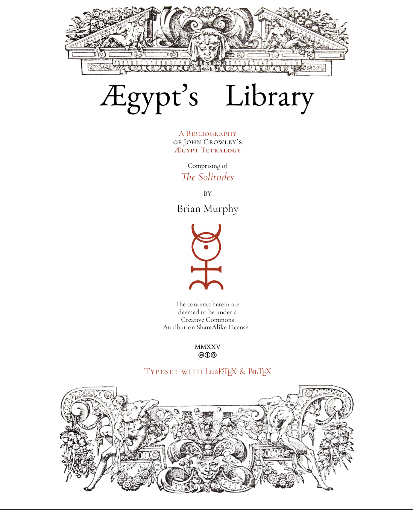

# Aegypt's Library

This is the public repository for Aegypt's Library, a project I created to list all of the 
authors and books, both real and fictional, mentioned within John Crowley's amazing Aegypt tetralogy.

I am currently posting updates to this project to my substack, [Ægypt Bibliography](https://aegyptbibliography.substack.com/).



# Build
I am producing this in TeXstudio and using the following build macro to compile.
* lualatex
* biber
* mkindex
* lualatex
* lualatex
* lualatex 

Or in the build macro option of the app:
```
txs:///compile | txs:///bibliography | txs:///index | txs:///compile | txs:///compile | txs:///compile | txs:///view-pdf
```


## License
Aegypt's Library  © 2026 by Brian Murphy is licensed under CC BY-SA 4.0. To view a copy of this license, visit https://creativecommons.org/licenses/by-sa/4.0/

